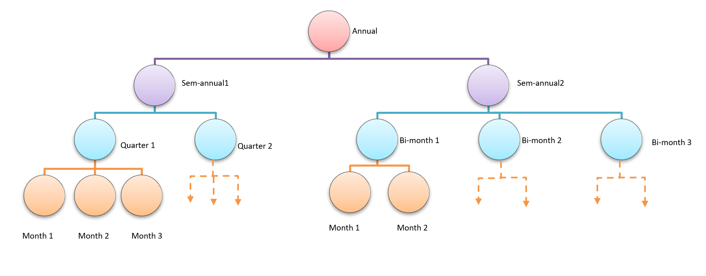

# A Hierarchical Reconciliation Least Square Method for Linear Regression

#### The repository contains the experiment data and implementation of this HRLS model in the paper titled "A Hierarchical Reconciliation Least Square Method for Linear Regression" submitted to PAKDD 2022. 
We propose a novel hierarchical forecasting structure of linear regression model and hierarchical reconciliation least square (HRLS) method, which can improve the accuracy of forecasting and consistency of forecasting，especially when the modelling uncertainty increased. This repository contains all data and source code of experimental studies of this paper.  It guarantees the reproducibility of the paper. 


### Running Environment
#### Python packages
The repo has been tested on Python 3.9.

|  Package   | Version  |
|  ----  | ----  |
|numpy|1.21.0|
|sklearn|0.0|
|statsmodels|0.12.2|
|pandas|1.3.0|
|matplotlib|3.4.2|
|mxnet|1.7.0|


### Training and Evaluation 
Download the Latest Version of HRLS and place them into `data`. The file folder should be in the following structure:
```
├── Salary_Prediction_Problem
│   ├── k-fold cross-validation.py
|   └── dataset
|       └──IncomeOfAutomobileIndustry.xlsx
|       └── ...
├── SyntheticData_Test
|	├── create_data.py
│   ├── divide_dataset.py
|   ├── HRLS_Test.py
|   ├── log.txt
|   └── dataset
|       └──manual_dataAA.xlsx
|       └──manual_dataAB.xlsx
|       └── ...
|   └── pic
|       └──P0.png
|       └──P1.png
|       └── ...
```
Each folder with `dataset` contains the required data for the corresponding test program. The `pic` folders contains the hierarchical linear relationship between the label in top level and the bottom level.  In addition, the train/val/test split dataset  can be reset by the divide_dataset.py config file.

To create  the Synthetic Data of the model:
```bash
cd SyntheticData_Test
python create_data.py
```
To divide the dataset of the model:
```bash
cd SyntheticData_Test
python divide_dataset.py
```
To apply training of the model:
```bash
cd SyntheticData_Test/Salary_Prediction_Problem
python HRLS_Test/k-fold cross-validation.py 
```
The model will be saved in `SyntheticData_Test/log.txt`, where every test result and model coefficient will store in it.

